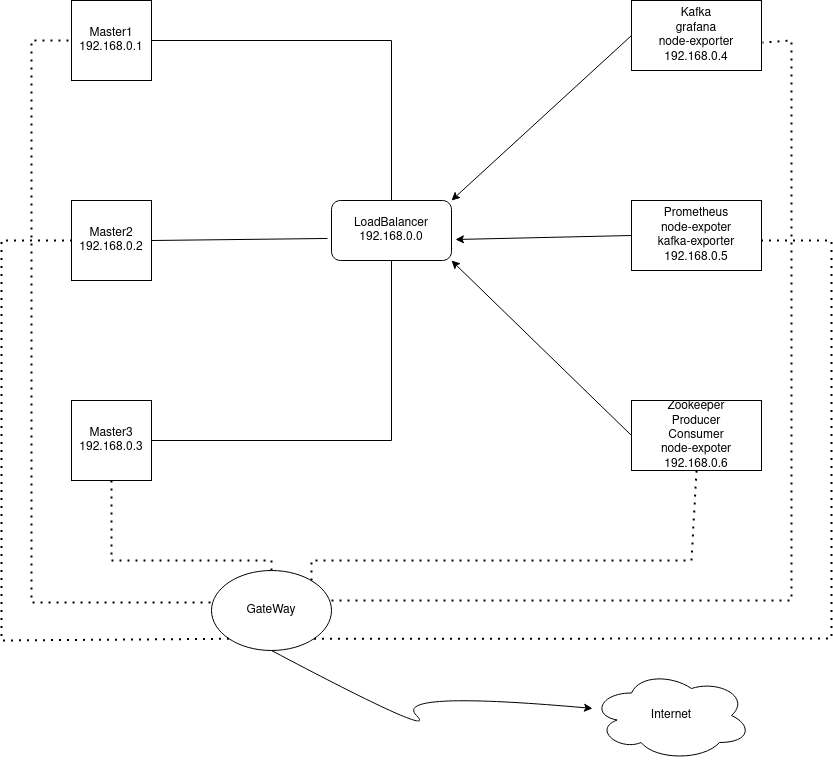

# ArvanCloud-Project

The whole project of ArvanCloud's take-home assignment.

in this project, we used `kubernetes` to manage our containers. 

Here we have a very simple application in which producer generates messages over epoch timestamp in ms and the consumer transforms it to RFC 33339 and this messages enter a messaging system like `kafka` .

we also used a monitor `Prometheus & grafana` to monitor all servers and all containers.

### How did I solve this problem?
I'm an Algorithm enthusiast! And one of the main algorithms for solving big problems is `Divide  & conquer`; So I decided to break this problem into smaller subproblems, solve them, and finally merge them on the main problem.

Here is the way of my thinking and how I broke the problem:

1) Understand the whole problem and find the relations between given data.
2) A high level thinking of the needed system design.
3) Think about trade-offs that I should make about each path. (I truly believe in William Kennedy's famous quote: `Nothing is free! Everything has cost!`)

Now the implementing part starts with baby steps:

4)  producer to write messages to 'input' topic with epoch timestamp
5)  Consumer to read from 'input' topic
6)  Producer in Consumer file to write messages to 'output' topic with date string RFC 3339
7)  write docker file for application and build image
8)  Create a Kubernetes cluster using the Kubeadm(single Master)
9)  Create a Kubernetes cluster using the Kubeadm(HA)
10) ansible for setup kubernetes
11) manifest for kafka(persist data)
12) ansible for kafka
13) manifest for application container
14) ansible for application
15) manifetst for prometheus(persist data)
16) ansible for premetheus
17) manifest for grafana(persist data)
18) ansible for grafana
19) scrap kubernetes metrics
20) manifest for kakfa exporter
21) ansible for exporter
22) create dashboard and give json file 
23) ansible for grafana dashboards

Find out how I deal with these issues in ansible.

### What was my trade-offs?
* **Infrastructure**

I was thinking about 2 different infrastructures:

1) All servers are locally expressed and their internet is provided through gateway server.

As it is clear, all servers have minimal access and this can make this solution the best option. On the other hand, here we need a web server to perform a proxy pass operation in gateway  In the event that It is better if we can use HAProxy.

2) Only server HAProxy has a valid IP and acts as a gateway for the rest of the servers.

This solution seems to be better, but if we think a little, we will see that our HAProxy is currently both a gateway, load balancer, and do Proxy pass , and has a lot of access.

I preferred to stick to the first option to demonstrate my networking skills and restrict further access .
I used the nginx web server to make sure the project was completed faster and easier :)

* **Network Plugin**

    *Flannel vs Calico*

Because :
1) uses BGP `Border Gateway Protocol` and Bird `BIRD Internet Routing Daemon`, a daemon called Felix configures routes on Bird
2) It costs less on the cloud than on the Flannel.
3) supports Network Policies
4) uses iptables for routing
5) has a CLI tool named calicoctl

* **Persist your data**

Here I have used `hostpath` to protect my data

Because :
1) Time was a priority for me and working with `storage clases` was time consuming
2) In contrast, the `emptyDir` , which disappears when a pod is finished, was a better option
3) The data remains until node changes

I belive engineering is all about these trade-offs and the decision that we take...

### **Diagrams**
This is the relation that I found between the given data :



### **Run In Development Environment

At the very beginning you need to install `ansible`

```
sudo apt install -y ansible
```

Note that :
1) Be sure to replace your server's IPs
2) Enter your gate password in the `inventory/group_vars/all.yml` file
3) Change the username and password of Grafana in the `roles/monitoring/vars/main.yml` file
4) So just run the following command

Now run this command on your host. If you are not using vault, delete the second part of the command

```
ansible-playbook start-project.yml --ask-vault-pass
```

There is nothing left. you can :)
Execute the following command inside the gateway

```
ansible-playbook sites.yml --ask-vault-pass
```

Follow the instructions below to make sure your Kuber is healthy

```
kubectl get nodes
kubectl get pods -A
kubectl get pv
```

And finally it was over .

